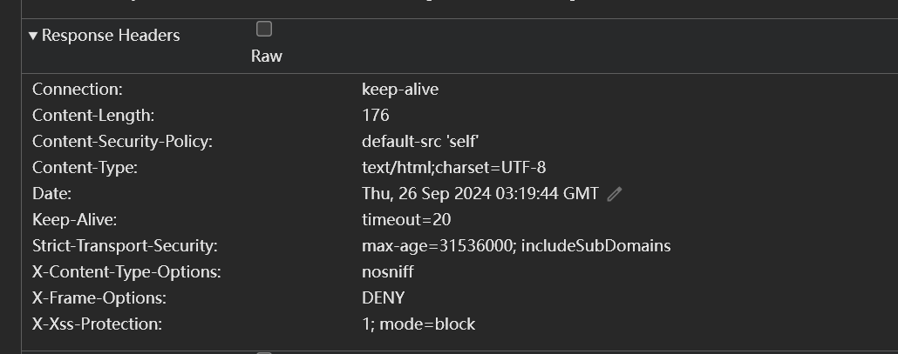
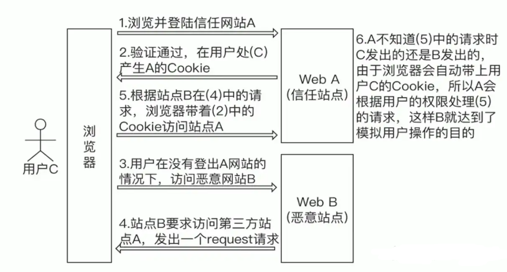
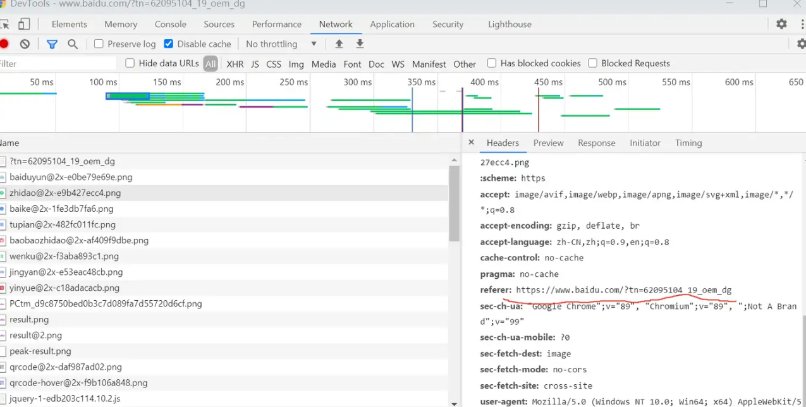
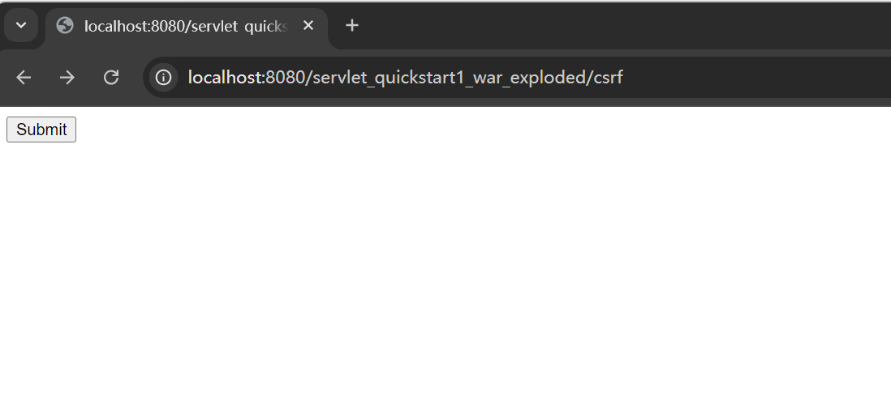
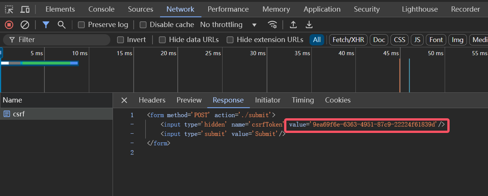
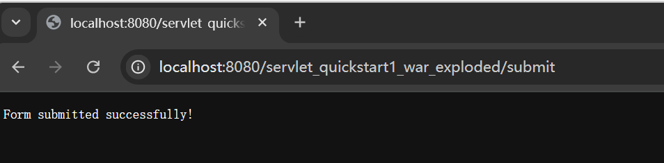
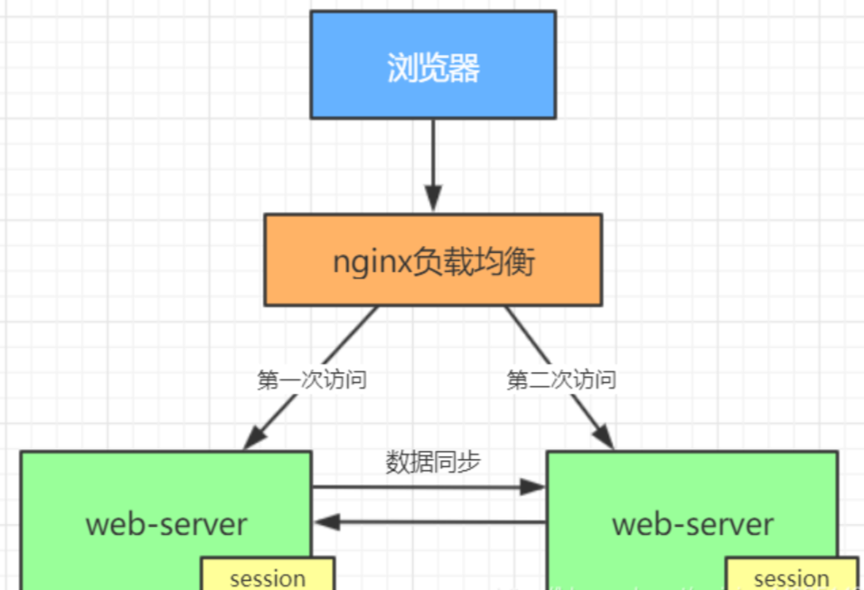
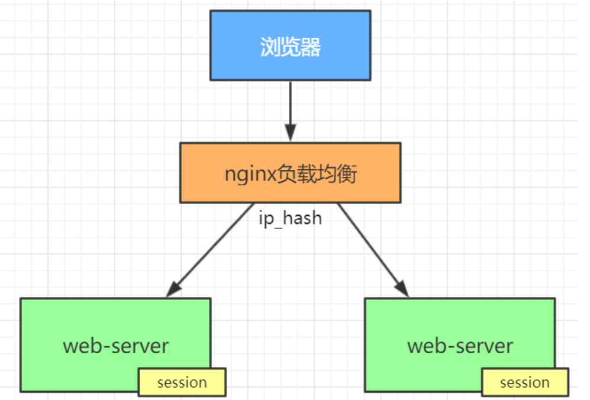
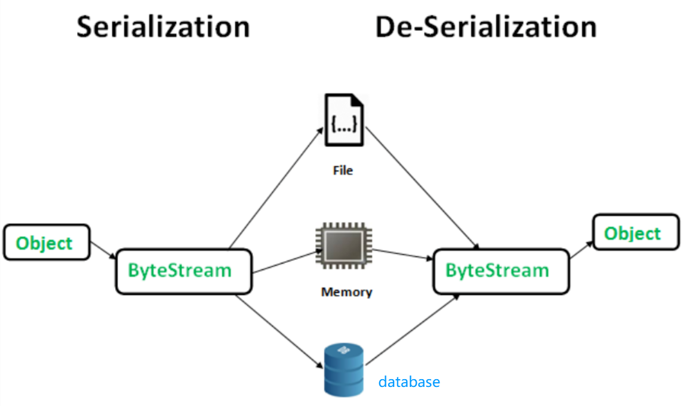

## 《作业一: 会话技术知识扩展》
>**学院:省级示范性软件学院**
>
>**题目:**《作业一: 会话技术内容扩展》
>
>**班级:** 软工2204
>
>**日期:** 2024-09-25
>
>**实验环境:** IntelliJ IDEA 2024.2.0.1

# 1. 会话安全性  

## 1.1会话劫持和防御

### 1.1.1会话劫持定义  
会话劫持（又名 cookie 劫持或 cookie side-jacking）是一种网络攻击，攻击者接管合法用户的计算机会话以获取其会话 ID，然后在任意数量的网络服务上充当该用户。 这种类型的攻击对应用程序安全是有害的，因为它允许攻击者以合法用户的名义获得对受保护帐户（及其中存储的数据）的未授权访问。  

### 1.1.2会话劫持的工作原理
当攻击者获得对用户会话 ID 的未授权访问权限时，会话劫持就开始了。 攻击者通常通过窃取用户的会话 cookie（因此也称为 cookie 劫持）或诱使用户单击包含预测会话 ID 的恶意链接（下文将详细介绍）来获得此访问权限。

一旦攻击者获得会话 ID 并且用户已登录服务，攻击者便可以接管会话。 他们通过将合法用户的会话 ID 应用到他们的浏览器来做到这一点，这会诱使服务认为攻击者是参与同一会话的合法用户。

在此伪装下，攻击者随后可以伪装成合法用户并访问任何信息或执行用户有权执行的任何操作。 在用户进行单点登录 (SSO) 的情况下，攻击者可以使用这种方法获得对任意数量应用程序的未授权访问权限，从而严重损害全面的应用程序安全性。
### 1.1.3防御方法
1. **使用HHTPS：** 确保团队使用的网站和应用程序遵守对所有内容使用 SSL/TLS 加密的标准，包括共享会话密钥。
2. **依赖 web 框架进行会话 cookie 管理：** 生成的会话 cookie 越长、越多越好，因为这会使它们更难预测或猜测，从而提供针对暴力攻击的保护。 
3. **认证后更改会话密钥：** 防止会话固定攻击的最佳方法是在登录时进行身份验证后立即更改会话密钥。
4. **引入额外的身份验证区域：** 在初始登录和生成的会话 cookie 之外添加新的身份验证区域也可以提供另一层保护。
5. **引入入侵检测系统（IDS）和入侵保护系统（IPS）：** IDS 和 IPS 将站点流量与已知攻击签名的数据库进行比较。 如果这些系统找到匹配项，它们将阻止该流量并提醒系统所有者。
6. **时间框用户会话和/或需要自动注销：** 考虑制定管理用户结束会话方式的策略。

### 1.1.4防御代码例子 
1. **依赖 web 框架进行会话 cookie 管理**  
**设置Cookie部分**
```java
// 创建一个名为"myCookie"，值为"cookieValue"的Cookie
Cookie cookie = new Cookie("myCookie", "cookieValue");

// 设置Cookie属性以增强安全性
cookie.setHttpOnly(true);  // 防止JavaScript访问该Cookie
cookie.setSecure(true);     // 仅在HTTPS连接中传输该Cookie
cookie.setPath("/");        // 在整个应用中有效

// 设置Cookie的过期时间为1小时
cookie.setMaxAge(60 * 60); 

// 将Cookie添加到响应中
response.addCookie(cookie);
```
**获取Cookie部分**  
```java
// 遍历请求中的所有Cookie
for (Cookie cookie : cookies) {
    // 检查当前Cookie是否为我们想要的"myCookie"
    if ("myCookie".equals(cookie.getName())) {
        // 返回找到的Cookie的值
        return cookie.getValue();
    }
}

// 如果未找到Cookie，通常会返回一个提示信息
```
2. **时间框用户会话和/或需要自动注销**
```java
@Override
protected void doGet(HttpServletRequest req, HttpServletResponse resp) throws ServletException, IOException {
    HttpSession session = req.getSession();
    session.setMaxInactiveInterval(1800); // 30分钟
    // 其他处理逻辑
}
```
## 1.2跨站脚本攻击（XSS）和防御
### 1.2.1跨站脚本攻击定义
跨站脚本攻击（Cross-Site Scripting，简称XSS）是Web应用程序安全中的一种重要威胁。攻击者利用XSS漏洞可以在用户浏览的网页中注入恶意脚本，从而盗取用户数据、劫持用户会话、修改网页内容等。  

### 1.2.2跨站脚本攻击原理
XSS攻击通过在网页中注入恶意脚本，使这些脚本在用户浏览该网页时执行。其核心原理在于Web应用程序未能正确处理和过滤用户输入，使得攻击者可以将恶意代码注入到页面中。
### 1.2.3跨站脚本攻击的防御措施  
1. **输入验证和输出编码：** 对用户输入进行严格验证，并对输出进行编码，防止恶意脚本执行
```java
String userInput = request.getParameter("input");
 //从HTTP请求获取名为input的参数，通常为用户在表单中的输入

String safeOutput = StringEscapeUtils.escapeHtml4(userInput);
//StringEscapeUtils.escapeHtml4方法将特定字符转换为对应的HTML实体
response.getWriter().write(safeOutput);
//将经过编码的安全输出写入到HTTP响应中，发送回用户的浏览器
```
2. **使用HTTP头:** 使用 HTTP 头部如 Content-Security-Policy 来限制外部资源的加载。
```java
import java.io.IOException;
import javax.servlet.ServletException;
import javax.servlet.annotation.WebServlet;
import javax.servlet.http.HttpServlet;
import javax.servlet.http.HttpServletRequest;
import javax.servlet.http.HttpServletResponse;

@WebServlet("/secureHeaders")
public class SecureHeadersServlet extends HttpServlet {

    protected void doGet(HttpServletRequest request, HttpServletResponse response) 
            throws ServletException, IOException {
        // 设置内容类型
        response.setContentType("text/html;charset=UTF-8");

        // 设置安全头部
        response.setHeader("Content-Security-Policy", "default-src 'self'");
        response.setHeader("X-Content-Type-Options", "nosniff");
        response.setHeader("X-Frame-Options", "DENY");
        response.setHeader("X-XSS-Protection", "1; mode=block");
        response.setHeader("Strict-Transport-Security", "max-age=31536000; includeSubDomains");

        // 输出 HTML 响应
        response.getWriter().println("<html>");
        response.getWriter().println("<head><title>安全头示例</title></head>");
        response.getWriter().println("<body>");
        response.getWriter().println("<h1>HTTP 安全头已设置</h1>");
        response.getWriter().println("<p>这些头可以帮助提高应用程序的安全性。</p>");
        response.getWriter().println("</body>");
        response.getWriter().println("</html>");
    }
}
```
**如图**  
  

3. **使用安全的库：** 使用成熟的库或框架来处理用户输入和输出，比如 OWASP 提供的工具。  

## 1.3 跨站请求伪造(CSRF)和防御
### 1.3.1 CSRF定义
CSRF (Cross-site request forgery，跨站请求伪造)也被称为One Click Attack或者Session Riding，通常缩写为CSRF或者XSRF，是一种对网站的恶意利用.
### 1.3.2 CSRF原理
构造链接，黑客在自己的网站或邮箱等引诱已登录用户点击按钮等，来请求想要攻击的网站，浏览器会携带已登录用户的Cookie去访问黑客想要攻击的网站。CSRF攻击利用网站对于用户网页浏览器的信任。  

### 1.3.3 CSRF防御措施
1. **添加HTTP Referer：** 这个Referer字段主要是标明我们请求的来源，当我们通过一个恶意站点去访问一个可信任的站点的时候，可信任站点其实是能够识别这个请求是来自恶意站点的，因为Referer字段会标明它的来源。  
以某一网站为例，如下图可见Referer  

站点还可以对一些敏感操作限制其Referer字段的值，比如某站点转账的时候使用：
```
http:bank.example/withdraw?account=bob&amount=10000000&for=Mallory
```

2. **使用CSRF Token:**
在HTTP请求中以参数的形式加入一个随机产生的Token，服务器接收到用户请求后会验证Token，如果没有Token或者Token不正确都会被认为是攻击而直接丢弃。  
**示例代码：**  
- 生成 CSRF Token
```java
import javax.servlet.ServletException;
import javax.servlet.annotation.WebServlet; 
import javax.servlet.http.HttpServlet; 
import javax.servlet.http.HttpServletRequest; 
import javax.servlet.http.HttpServletResponse;
import javax.servlet.http.HttpSession; 
import java.io.IOException; 
import java.util.UUID; // 导入 UUID 类，用于生成唯一标识符

@WebServlet("/csrf")
public class CsrfServlet extends HttpServlet {
    
    protected void doGet(HttpServletRequest request, HttpServletResponse response) throws ServletException, IOException {
        
        // 生成一个随机的 CSRF Token
        String csrfToken = UUID.randomUUID().toString();
        
        // 获取当前用户的会话对象
        HttpSession session = request.getSession();
        
        // 将生成的 CSRF Token 存储在会话中，以便后续验证
        session.setAttribute("csrfToken", csrfToken);

        response.setContentType("text/html");
        
        // 开始构建 HTML 表单，并将 CSRF Token 嵌入到隐藏字段中
        response.getWriter().write("<form method='POST' action='./submit'>");
        // 添加隐藏字段，在表单提交时包含 CSRF Token
        response.getWriter().write("<input type='hidden' name='csrfToken' value='" + csrfToken + "' />");
        response.getWriter().write("<input type='submit' value='Submit' />");
        response.getWriter().write("</form>");
    }
}
```
- 验证 CSRF Token
```java
@WebServlet("/submit")
public class SubmitServlet extends HttpServlet {
    protected void doPost(HttpServletRequest request, HttpServletResponse response) throws ServletException, IOException {
        HttpSession session = request.getSession();
        String sessionToken = (String) session.getAttribute("csrfToken");
        String requestToken = request.getParameter("csrfToken");

        // 验证 Token
        if (sessionToken != null && sessionToken.equals(requestToken)) {
            // Token 验证成功，可以处理表单数据
            response.getWriter().write("Form submitted successfully!");
        } else {
            // Token 验证失败
            response.sendError(HttpServletResponse.SC_FORBIDDEN, "Invalid CSRF Token");
        }
    }
}
```
**演示效果**  
访问如下地址，成功响应生成Token的Servlet,并在F12窗口的中可以看到已获取到Token的值


点击Submit，如果sessionToken的值与requestToken相同，即可提交成功，若不同，将拒绝发送且给予报错信息（图中为成功）

## 2. 分布式会话管理 

### 2.1 分布式环境下的会话同步问题
在分布式环境下，会话同步问题主要涉及如何在多个服务器之间保持用户会话的一致性和有效性。这包括状态管理、负载均衡、会话过期处理、数据一致性以及安全性等方面。

### 2.2 Session集群解决方案

1. **会话复制(Session Replication)：**   
优点：tomcat原生支持，只需要修改配置文件即可
缺点：session同步需要数据传输，会占用大量带宽，降低服务器集群的业务处理能力


2. **客户端存储（Client-Side Storage）：**   
优点：服务器不需要保存用户信息，节省服务器资源  
缺点：每次http请求，携带用户在cookie中的完整信息，浪费网络带宽；用户信息存储在cookie中，存在泄漏、篡改、窃取等安全隐患。

3. **hash一致性：**    
优点：只需要修改nginx配置，不需要修改应用程序代码  
缺点：session还是存在web-server中的，所以web-server重启可能导致部分session丢失，影响业务，如部分用户需要重新登录    

**参考网址：https://blog.csdn.net/weixin_44335140/article/details/112994824**

## 2.3 使用Redis等缓存技术实现分布式会话
1. **环境准备——增加依赖**  
确保你已经安装了Redis，并且你的Java项目中引入了Jedis库（Redis的Java客户端）
```
<dependency>
    <groupId>redis.clients</groupId>
    <artifactId>jedis</artifactId>
    <version>3.6.0</version>
</dependency>
```
2. **Redis配置类**
```java
import redis.clients.jedis.Jedis;
import redis.clients.jedis.JedisPool;

public class RedisConfig {
    private static JedisPool jedisPool;

    static {
        // 初始化连接池
        jedisPool = new JedisPool("localhost", 6379); // 替换为你的Redis地址和端口
    }

    public static Jedis getJedis() {
        return jedisPool.getResource();
    }
}

```
3. **会话管理类**  
```java
import redis.clients.jedis.Jedis;

import java.util.HashMap;
import java.util.Map;

public class SessionManager {
    
    // 存储会话数据
    private static final String SESSION_PREFIX = "session:";

    // 创建会话
    public static String createSession(String userId) {
        try (Jedis jedis = RedisConfig.getJedis()) {
            String sessionId = generateSessionId(); // 生成唯一的会话ID
            Map<String, String> sessionData = new HashMap<>();
            sessionData.put("userId", userId);
            sessionData.put("timestamp", String.valueOf(System.currentTimeMillis()));

            // 存储会话数据到Redis中，设置过期时间
            jedis.hmset(SESSION_PREFIX + sessionId, sessionData);
            jedis.expire(SESSION_PREFIX + sessionId, 3600); // 1小时过期
            
            return sessionId; // 返回会话ID
        }
    }

    // 获取会话数据
    public static Map<String, String> getSession(String sessionId) {
        try (Jedis jedis = RedisConfig.getJedis()) {
            return jedis.hgetAll(SESSION_PREFIX + sessionId); // 获取会话数据
        }
    }

    // 删除会话
    public static void deleteSession(String sessionId) {
        try (Jedis jedis = RedisConfig.getJedis()) {
            jedis.del(SESSION_PREFIX + sessionId); // 删除会话数据
        }
    }

    // 生成会话ID（可以使用UUID等方法）
    private static String generateSessionId() {
        return String.valueOf(System.currentTimeMillis()); // 简单示例，建议使用UUID
    }
}
```
4. **示例使用**
```java
public class Main {
    public static void main(String[] args) {
        // 创建会话
        String sessionId = SessionManager.createSession("user123");
        System.out.println("Created session ID: " + sessionId);

        // 获取会话数据
        Map<String, String> sessionData = SessionManager.getSession(sessionId);
        System.out.println("Session Data: " + sessionData);

        // 删除会话
        SessionManager.deleteSession(sessionId);
        System.out.println("Session deleted.");
    }
}
```
以上代码展示了如何使用Redis实现分布式会话存储。用户可以创建会话、获取会话信息以及删除会话。请根据实际需求扩展功能，比如更复杂的会话管理逻辑、更安全的会话ID生成等。
# 3. 会话状态的序列化和反序列化
## 3.1 会话状态的序列化和反序列化
### 3.1.1 序列化与反序列化的概念
序列化是指将对象的状态信息转换为可以存储或传输的形式的过程。这通常涉及到将数据结构或对象转换成字节流或字符串格式。反序列化则是序列化的逆过程，即将序列化后的数据转换回原始的数据结构或对象。  
**通过对象序列化，可以方便的实现对象的持久化储存以及在网络上的传输。大致的过程如下图所示：**

作者：扬俊的小屋 转载自 https://blog.csdn.net/qq_19782019/article/details/80422143
### 3.1.2 序列化与反序列化的区别
- 方向性：序列化是数据从内存到存储/传输的转换，而反序列化则是从存储/传输到内存的转换。
- 目的性：序列化用于数据的持久化和网络传输，反序列化用于数据的恢复和使用。
## 3.2 为什么需要序列化会话状态
1. **持久化数据：** 当用户在网站上进行操作时，可能会遇到服务器重启或崩溃的情况。通过序列化，可以将当前会话状态（如购物车内容、用户设置等）保存到持久存储（例如数据库或文件系统）。这样，服务器恢复后，用户可以继续他们的操作，而不会丢失数据。
2. **跨网络传输:** 在微服务架构或分布式应用中，用户请求可能会被路由到不同的服务。序列化会话状态使得服务能够方便地将会话数据从一个节点传输到另一个节点。例如，一个用户可能在一个微服务中开始购物，而在另一个微服务中完成支付。
3. **数据一致性：** 在复杂的应用中，用户的会话可能涉及多个操作和状态变化。序列化有助于在这些操作之间维护数据的一致性。例如，在处理订单时，确保订单状态、付款信息及用户资料在多个步骤中保持一致。
## 3.3 Java对象序列化和反序列化
1. **创建一个可序列化的类**
```java
import java.io.Serializable;

// 创建一个User类，实现Serializable接口
public class User implements Serializable {
    private static final long serialVersionUID = 1L; // 用于序列化版本控制

    private String name;
    private int age;

    // 构造函数
    public User(String name, int age) {
        this.name = name;
        this.age = age;
    }

    // Getter方法
    public String getName() {
        return name;
    }

    public int getAge() {
        return age;
    }

    // 重写toString方法，方便输出用户信息
    @Override
    public String toString() {
        return "User{name='" + name + "', age=" + age + '}';
    }
}
```
2. **序列化与反序列化**
```java
import java.io.*;

public class SerializationDemo {
    public static void main(String[] args) {
        // 创建一个User对象
        User user = new User("Alice", 30);
        
        // 序列化
        try (ObjectOutputStream oos = new ObjectOutputStream(new FileOutputStream("user.ser"))) {
            oos.writeObject(user); // 将对象写入文件
            System.out.println("User serialized: " + user);
        } catch (IOException e) {
            e.printStackTrace();
        }

        // 反序列化
        try (ObjectInputStream ois = new ObjectInputStream(new FileInputStream("user.ser"))) {
            User deserializedUser = (User) ois.readObject(); // 从文件中读取对象
            System.out.println("User deserialized: " + deserializedUser);
        } catch (IOException | ClassNotFoundException e) {
            e.printStackTrace();
        }
    }
}
```
**解释JAVA对象序列化和反序列的过程**
1. **创建 User 对象：** 在 main 方法中，实例化一个 User 类的对象（假设该类实现了 Serializable 接口），用以进行序列化。 

2. **序列化过程：**  
- 使用 ObjectOutputStream 和 FileOutputStream 创建一个输出流，将 User 对象写入名为 user.ser 的文件。
- 调用 writeObject() 方法将对象序列化并保存到文件中。
- 捕获可能出现的 IOException，确保在写入过程中处理错误。 

3. **反序列化过程：** 
- 使用 ObjectInputStream 和 FileInputStream 创建一个输入流，从 user.ser 文件中读取对象。
- 调用 readObject() 方法反序列化对象，并将其转换为 User 类型。
- 同样捕获可能出现的 IOException 和 ClassNotFoundException，确保在读取过程中处理错误。
4. **输出结果：** 分别在序列化和反序列化后打印用户对象的信息，以确认操作成功。

## 3.4 自定义序列化策略  
### 3.4.1 自定义序列化解释：
自定义序列化策略允许你在 Java 中控制对象的序列化和反序列化过程，以满足特定需求。通过实现 Serializable 接口，你可以定义哪些字段需要被序列化以及如何处理它们。  
### 3.4.2 常用的自定义序列化策略
1. **自定义序列化方法**
通过定义 writeObject 和 readObject 方法，你可以完全控制序列化和反序列化过程。例如：
```java
private void writeObject(ObjectOutputStream oos) throws IOException {
    oos.defaultWriteObject(); // 序列化默认字段
    // 进行额外处理，比如加密某个字段
    oos.writeObject(encrypt(password));
}

private void readObject(ObjectInputStream ois) throws IOException, ClassNotFoundException {
    ois.defaultReadObject(); // 反序列化默认字段
    // 进行额外处理，比如解密某个字段
    password = decrypt((String) ois.readObject());
}
```
2. **控制版本**
使用 serialVersionUID 来控制序列化版本，确保在反序列化时版本兼容,如果类结构发生变化，修改 serialVersionUID 可以防止反序列化失败。
```java
private static final long serialVersionUID = 1L;
```
3. **选择性序列化**
如果某些字段不需要序列化，可以使用 transient 关键字标记这些字段。例如：
```java
import java.io.Serializable;

public class User implements Serializable {
    private String name;
    private transient String password; // 不序列化

    public User(String name, String password) {
        this.name = name;
        this.password = password;
    }
}
```


