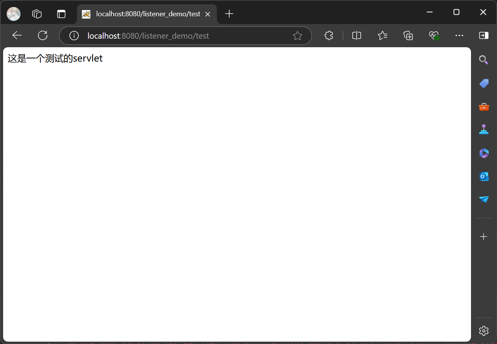
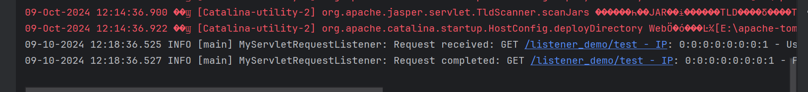

# 请求日志记录功能
## 一、实现过程
1. **启动程序**
点击RUN后，在地址栏输入http://localhost:8080/listener_demo/test进入测试页面，如下图所示

2. **日志记录输出**
进入页面后，在输出台会有如下输出

完整输出为
````
09-10-2024 12:18:36.525 INFO [main] MyServletRequestListener: Request received: GET /listener_demo/test - IP: 0:0:0:0:0:0:0:1 - User-Agent: Mozilla/5.0 (Windows NT 10.0; Win64; x64) AppleWebKit/537.36 (KHTML, like Gecko) Chrome/129.0.0.0 Safari/537.36 Edg/129.0.0.0
09-10-2024 12:18:36.527 INFO [main] MyServletRequestListener: Request completed: GET /listener_demo/test - IP: 0:0:0:0:0:0:0:1 - Processing time: 2 ms
````
## 二、注意事项
- 为了让输出和系统自带的日志记录区分，使用 System.out.println，使得输出为白色，能直观观察到功能展示
- 如果要跟系统一样完整的日志格式，可以创建一个日志记录器 (Logger) 实例，然后调用其方法logger.info()来实现。如下属代码，第二句替换System.out.println这一句即可。
````
  private static final Logger logger = Logger.getLogger(MyServletRequestListener.class.getName());
  logger.info(formatLog("Request completed", method, requestURI, ipAddress, null, null, processingTime));
````