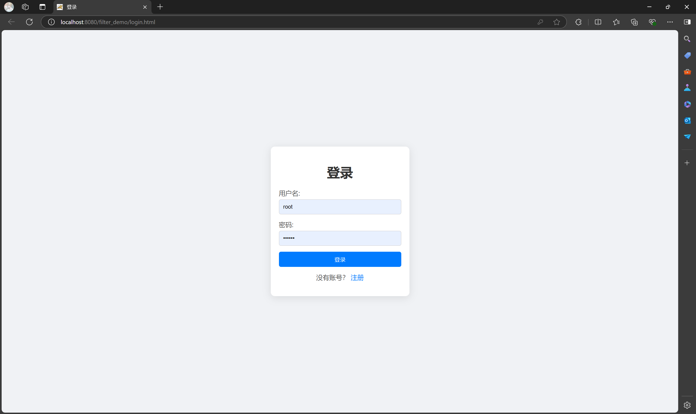
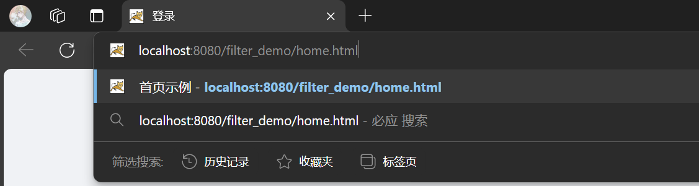
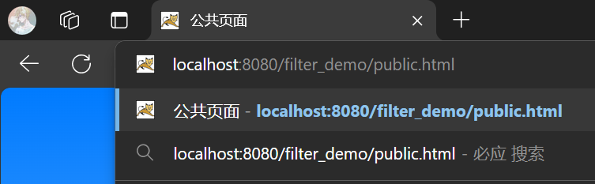
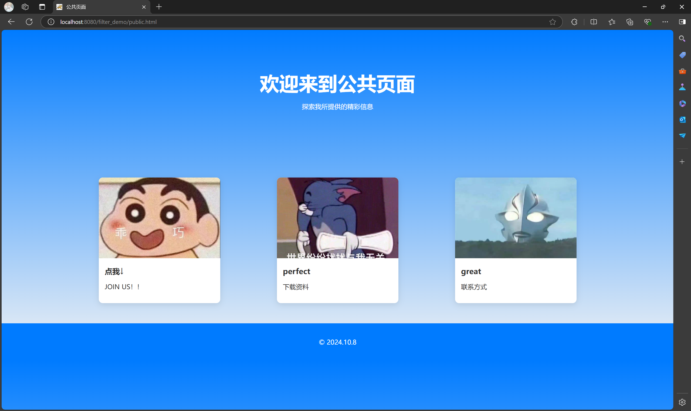
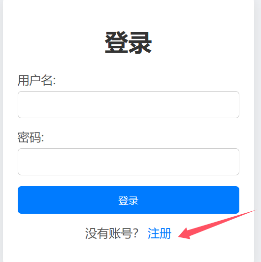
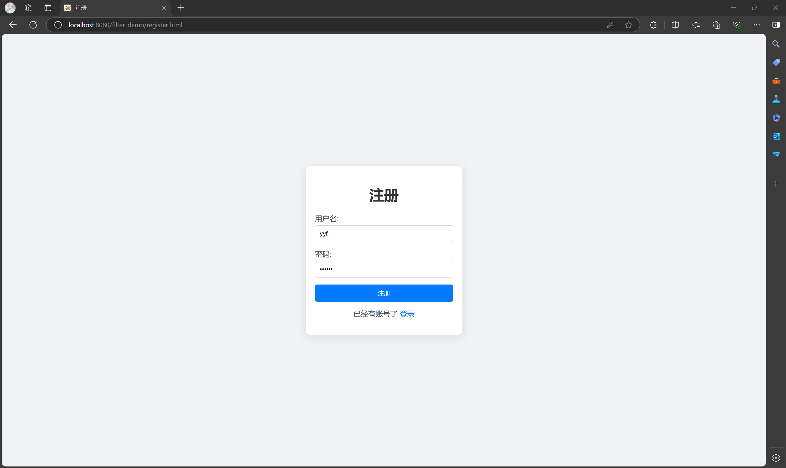
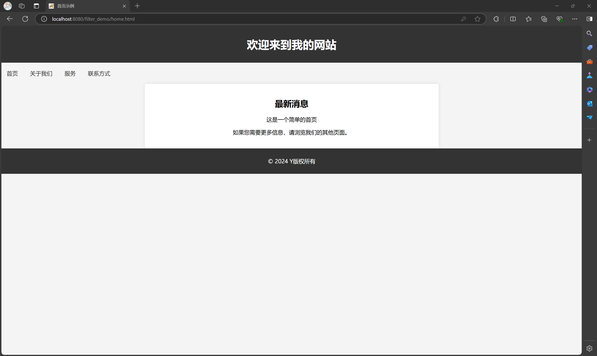

# 登录验证过滤器
## 一、实现过程(包含额外功能)
1. **启动程序**  
启动后过滤器会过滤每一个地址，因为尚未登录所以会直接重定位到./login.html页面，如下图：

2. **进入首页**  
在地址栏输入下图所示的地址，按Enter之后会发现无法访问首页，因为还未登录，所以被过滤器重定位到./login.html

3. **未登录访问公共页面**
在地址栏输入下图所示地址，会成功访问到公共页面(输入http://localhost:8080/filter_demo/register.html也可以直接访问，因为过滤器会直接过滤掉登录、注册、公共页面)


4. **进行登录**  
在登录页面，通过输入一个用户名和密码，点击登录后，依然没有进入首页。因为下面这段代码的作用为获取注册了的用户信息，我们还未注册所以不能登录。
```java
private static Map<String, String> users = RegisterServlet.getUsers();
```
5. **进行注册——登录**  
点击登录页面的注册

输入账号和密码进行注册

点击注册后自动跳转到登录页面，这时输入刚刚注册的账号密码即可登录成功进入首页，如下图

**原理解释**  
在注册页面的后端代码中，下图中这句，使用了Map<String, String>接口，表示一个键值对集合。在这个例子中，键和值都是字符串类型 (String)。new HashMap<>()这句是创建了一个新的 HashMap 实例。HashMap 是 Map 接口的一种常见实现，提供了基于哈希表的数据存储方式，允许快速的插入和查找操作。当用户名没有重复时， users.put(username, password);会将这个键值对存储在users中。同时还有一个getUsers函数，用于在登录界面的后端获取注册用户信息。
```java
@WebServlet("/register")
public class RegisterServlet extends HttpServlet {
    // 存储用户信息的 HashMap，键为用户名，值为密码
    private static Map<String, String> users = new HashMap<>(); // 存储用户信息

    @Override
    protected void doPost(HttpServletRequest request, HttpServletResponse response) throws ServletException, IOException {
        // 从请求中获取用户名和密码
        String username = request.getParameter("username");
        String password = request.getParameter("password");

        // 检查用户名是否已存在
        if (users.containsKey(username)) {
            response.sendRedirect("./register.html"); // 用户名已存在，重定向回注册页面
        } else {
            // 存储用户信息
            users.put(username, password);
            response.sendRedirect("./login.html"); // 注册成功，重定向到登录页面
        }
    }
    // 提供一个静态方法以便其他类获取用户信息
    public static Map<String, String> getUsers() {
        return users;
    }
}
```
## 二、注意事项
- 在启动程序时，如果未登录直接进入首页成功了，刷新一下即可。最好启动后先刷新完浏览器再测试。（本人电脑运行遇到过）
- 若要仿造写该功能，请注意直接过滤的排除列表内地址需要写准确，如：网页URI为/filter_demo/login，但是在排除列表内写"/login"的话不会直接过滤，可能会导致循环重定向，IDEA会报错无法打开这个URL。
## 三、功能总结
- 有一个排除列表,包含不需要登录就能访问的路径("/filter_demo/login", "/filter_demo/register", "/filter_demo/public")
- 利用哈希函数进行存储注册用户信息，而不是设置一个唯一值进行检测，具有灵活性和合理性
- 未注册（即没有账号）不能登录
- 检查用户是否登录，如果用户已登录,允许请求继续；如果用户未登录,将请求重定向到登录页面。